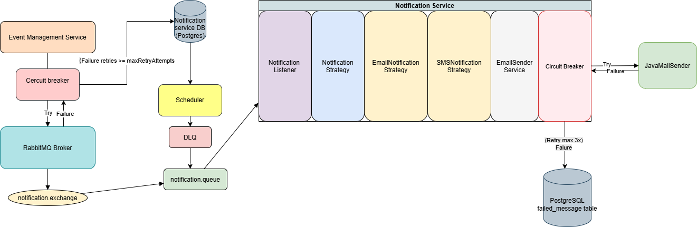

# Scalable Event Management System (Backend)

## Configuration Summary

The application is named `event-management-system` and uses PostgreSQL for persistence. It includes the following configurations:

- **Database:** Connects to a PostgreSQL database at `localhost:5006` with default credentials.
- **JPA:** Enabled automatic DDL generation and uses the PostgreSQL dialect.
- **JWT Authentication:** Secured with a secret key and tokens expire after 1 hour.
- **Rate Limiting:** Limits each user/IP to 50 requests per minute to prevent abuse.
- **caffeine cache:** to improve the performance.
- **security key loads from .env file:** to avoid key leakage.
- **HATEOAS:** Applied to event controller

## Default Users Initialization
During application startup, two default users are automatically created for testing and development purposes.

This is handled by the following component:
: src/main/java/com/example/eventmanagement/init/DataInitializer.java

Predefined Users:

    Name: admin
    Email: admin@gmail.com
    Password: 123
    Role: ADMIN

    Name: lakshika
    Email: lakshika@gmail.com
    Password: 123456
    Role: USER

## Objective

Design and implement a production-ready RESFull API for an Event Management Platform. The system allows users to manage events and attendance with secure access, robust filtering capabilities, and performance optimization. It emphasizes scalability, clean architecture, and best practices.

## Core Requirements

### Entities

#### User
- `id`: UUID
- `name`: String
- `email`: String
- `role`: USER | ADMIN
- `createdAt`, `updatedAt`

#### Event
- `id`: UUID
- `title`: String
- `description`: String
- `hostId`: UUID (Foreign Key to User)
- `startTime`, `endTime`: Timestamp
- `location`: String
- `visibility`: PUBLIC | PRIVATE
- `createdAt`, `updatedAt`

#### Attendance
- `eventId`: UUID
- `userId`: UUID
- `status`: GOING | MAYBE | DECLINED
- `respondedAt`: Timestamp

## API Endpoints

* `POST /api/v1/auth/login`: Authenticate user and return JWT access token

* `POST /api/v1/events`: Create an event (Authenticated users only)
* `PUT /api/v1/events/{id}`: Update event (Only host or admin)
* `DELETE /api/v1/events/{id}`: Delete event (Only host or admin)
* `GET /api/v1/events`: List events with filters (date, location, visibility)
* `GET /api/v1/events/upcoming`: List upcoming events (paginated)
* `GET /api/v1/events/{id}/status`: Get event status
* `GET /api/v1/events/user/{userId}/all`: Events a user is hosting or attending
* `GET /api/v1/events/{eventId}/details`: Event details with attendee count

## Features

- JWT Authentication & Role-Based Authorization
- Pagination, Sorting, and Advanced Filtering
- Rate Limiting / Throttling (per user/IP)
- Soft Deletes for Events (archiving instead of hard delete)

## Retry, DLQ, and DB Fallback Enhancement

This enhancement introduces a robust message retry and fallback mechanism to ensure high availability and fault tolerance for notification delivery.

---

### Key Improvements

#### Circuit Breaker Integration

- Applied to RabbitMQ message sending.
- Uses Resilience4j.
- Triggers fallback after 3 failed attempts.

#### Retry Logic

- Retries up to `maxRetryAttempts` (e.g., 3) in-memory.
- Circuit breaker fallback saves the message to DB and attempts DLQ delivery.

#### Dead Letter Queue (DLQ)

- Messages that fail after 3 attempts are sent to `notification.dlq-queue`.
- DLQ is configured with a TTL (Time-To-Live).
- After TTL expiry, the message is re-routed to the main queue for re-processing.

#### DB Fallback (Failed Message Table)

- If DLQ delivery fails, the message is saved to PostgreSQL for scheduled reprocessing.
- Table: `failed_message`.

#### Scheduled Retry of DB-Persisted Failures

- A `@Scheduled` job runs every 2 hrs.
- Scans the `failed_message` table and republishes unsent messages to the DLQ then
DLQ auto-forward those messages to the main 'notification.queue' those messages will consumed
by notification micro service and process those to send emails.

## Notification Service Architecture

The following diagram illustrates the complete architecture of the Notification Service, showing how it interacts with RabbitMQ, PostgreSQL, and external services.

> The retry logic (Resilience4j Circuit Breaker) is visualized with "Try → Failure → Retry max 3x → DLQ/DB".

## Tech Stack

- Java 17
- Spring Boot 3.x
- Spring Security (JWT)
- Spring Data JPA (Hibernate)
- PostgreSQL
- Maven

## Testing

- Unit Testing: JUnit 5
- Integration Testing: H2 database
- Authentication Simulation: `@WithMockUser`, `@WithSecurityContext`
- Code Coverage: Ensure high coverage on services and controllers
